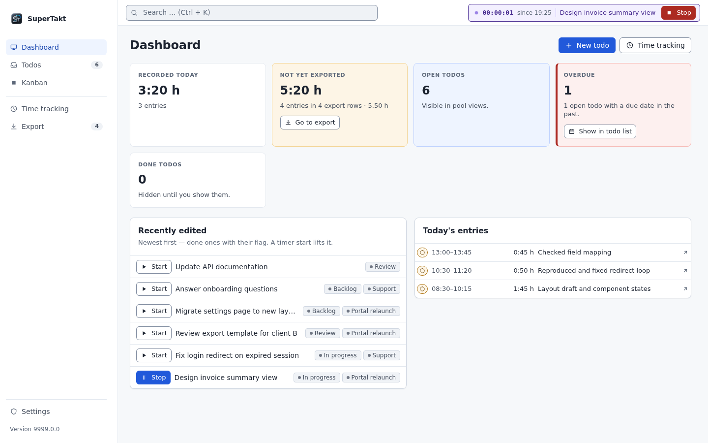
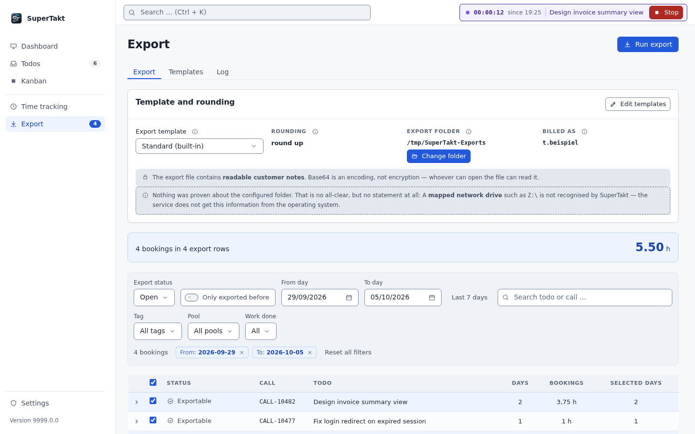

<div align="center">


# SuperTakt

**Todos, time tracking and billing exports in one app that never leaves your machine.**

[](https://github.com/KuyomieKurama/SuperTakt/releases/latest)
[](https://github.com/KuyomieKurama/SuperTakt/actions/workflows/pruefung.yml)
[](LICENSE)


[Download](https://github.com/KuyomieKurama/SuperTakt/releases/latest) · [User guide](docs/benutzerhandbuch.md) · [Developer guide](docs/entwicklerhandbuch.md)

<br>



<sub>The dashboard: a running timer, today's bookings and everything still waiting to be exported. Demo data.</sub>

</div>

<br>

SuperTakt is a desktop app for people who track work against todos and then have to bill that time somewhere else. You plan on a Kanban board, run a timer on the todo you are working on, and export the finished bookings as a file for your billing tool.

Everything runs on your own computer. There is no cloud service, no account, no database server and no telemetry. Data lives in a single embedded SQLite file in your application data directory.

## Why SuperTakt?

Time tracking usually breaks at the handover: the todo list lives in one place, the timer in another, and the billing sheet gets assembled from memory on Friday afternoon.

SuperTakt keeps those steps together:

- **One record per piece of work.** A booking belongs to a todo, and every booking is visibly either exported or still open.
- **Your billing format, not ours.** Exports are driven by templates, so the output can match what your billing tool expects.
- **Private by construction.** The local service only listens on `127.0.0.1`. The single outbound connection is a check for new releases on GitHub, and you can switch it off in the settings.

## Key features

**Kanban columns that are rules, not containers.**
A column is defined by required and excluded tags, status, done state and export state. A card appears because it matches, so the board cannot drift away from your data.

**Tags, nested folders and todo pools.**
Organise with tags inside folders of any depth, define pools through tags, and set default tags that apply to every new todo, including ones created from Outlook.

**A timer that copes with real days.**
Start and stop from the dashboard or from a card. With inactivity detection in the desktop app, idle time can be skipped as a break, assigned to a task, or split across several. Open assignments survive a restart.

**Billing exports from templates.**
Bookings are grouped per day and todo, and time is rounded in steps of 0.25 h (15 minutes). The default template writes `Call`, `Zeit`, `Notiz` and `WindowsUser`, and the structure is configurable through export templates.

**Outlook add-in.**
Create a todo straight from an email. If exactly one todo with the same call number already exists, the email is added to that todo instead of creating a duplicate.

**Backups and imports.**
Download a full JSON backup, restore it, or import from Todoist (CSV) and Super Productivity (JSON).

## Screenshots

<table>
  <tr>
    <td width="50%">
      
    </td>
    <td width="50%">
      
    </td>
  </tr>
  <tr>
    <td valign="top"><sub><b>Kanban.</b> Each column is a rule over tags and status. Cards show call number, due date and booked time.</sub></td>
    <td valign="top"><sub><b>Export.</b> Pick a template, filter open bookings and run the export.</sub></td>
  </tr>
</table>

<sub>All screenshots show invented demo data in the English interface.</sub>

## Getting started

### Download

Installers for each release are on the [Releases page](https://github.com/KuyomieKurama/SuperTakt/releases/latest):

| Platform | File |
|---|---|
| Windows 10/11, 64-bit | `SuperTakt_<version>_x64-setup.exe` |
| macOS, Apple Silicon | `SuperTakt_<version>_aarch64.dmg` |
| Debian, Ubuntu and relatives, 64-bit | `SuperTakt_<version>_amd64.deb` |
| Other Linux, 64-bit | `SuperTakt_<version>_amd64.AppImage` |

> [!IMPORTANT]
> The installers are **not code-signed**, so Windows and macOS warn you on first launch. The release notes explain how to proceed and list SHA-256 checksums. There is no build for Intel Macs.

### Run from source

You need Node.js 22.13 or newer, pnpm 11 or newer and a Rust toolchain with the Tauri system libraries for your OS.

```bash
git clone https://github.com/KuyomieKurama/SuperTakt.git
cd SuperTakt
pnpm install
pnpm desktop
```

The first `pnpm desktop` also builds the local service and downloads the pinned Node runtime for it, so it needs network access and some patience.

To try only the interface in a browser, without Rust (the browser has no inactivity detection and no Tauri shell, so the app shows a notice instead of its data unless a development session is wired up):

```bash
pnpm dev
```

To build an installer package:

```bash
pnpm desktop:build
```

To run the full project checks:

```bash
pnpm check
```

`pnpm check` runs type checks, boundary and contrast checks, proof scripts, tests with coverage, Rust tests, a build and a dependency audit. Some steps need extra system packages; see the [developer guide](docs/entwicklerhandbuch.md) and [apps/desktop/README.md](apps/desktop/README.md).

## Usage

A typical day with SuperTakt:

1. **Set up structure once.** Create tags and folders, then define pools or Kanban columns from them. Add default tags if every todo should start with some.
2. **Capture work.** Create todos in the app, or from an email through the Outlook add-in. On Windows, **Settings → Outlook add-in** guides you through trusting the local certificate; then import `apps/outlook-addin/manifest.xml` in Outlook and connect it with the access token from the same settings page. See [docs/outlook-certificate-setup.md](docs/outlook-certificate-setup.md).
3. **Track time.** Press **Start** on a todo from the dashboard, the todo list or a Kanban card. By default, stopping the timer asks for a short description of the work. That text goes into the billing export, while the todo's own note stays internal.
4. **Review.** The bookings overview shows what has been exported and what is still open.
5. **Export.** On the Export screen, choose a template, check the preview grouped by day and todo, and run the export into your export folder.

The interface language can be switched between German and English in the settings. The [user guide](docs/benutzerhandbuch.md) covers every screen in detail; it is currently written in German.

## Tech stack

| Layer | Technology |
|---|---|
| Desktop shell | Tauri 2 with a deliberately thin Rust layer |
| User interface | React, Vite, TypeScript |
| Local service | Node.js sidecar bound to `127.0.0.1` |
| Storage | Embedded SQLite, a single file |
| Outlook add-in | Office.js, TypeScript |
| Testing | Vitest, Playwright |

The code is a pnpm workspace. Business logic in `packages/domain` knows nothing about HTTP or SQL, which keeps storage replaceable. See [docs/architektur.md](docs/architektur.md) for the reasoning.

```text
packages/domain        Business rules: rounding, timer, export status, tag tree
packages/storage       Ports and the SQLite adapter
packages/export        Export template engine
packages/ui-tokens     Shared colour, type and spacing tokens
apps/local-api         Local HTTP service
apps/web               The user interface
apps/desktop           The Tauri shell
apps/outlook-addin     The Outlook add-in
```

## Documentation

| Document | Content |
|---|---|
| [docs/benutzerhandbuch.md](docs/benutzerhandbuch.md) | User guide (German) |
| [docs/entwicklerhandbuch.md](docs/entwicklerhandbuch.md) | Project structure, commands, lessons learned |
| [docs/architektur.md](docs/architektur.md) | Architecture decisions |
| [docs/datenarchiv.md](docs/datenarchiv.md) | Backup format and compatibility |
| [docs/glossar.md](docs/glossar.md) | Terms and their counterparts in the code |
| [docs/bedrohungsmodell.md](docs/bedrohungsmodell.md) | Threat model (German) |

## Contributing

There is no separate contribution guide yet. Before changing code, read the [developer guide](docs/entwicklerhandbuch.md) and the project rules in [CLAUDE.md](CLAUDE.md), which define directory ownership and quality gates. Please run `pnpm check` before opening a pull request.

## License

SuperTakt is released under the [MIT License](LICENSE).

## A note on the name

The product is called SuperTakt. Earlier versions were called Takt, so some internal identifiers, such as the `@takt/*` packages and the application data directories, keep the old name for compatibility with existing installations.
