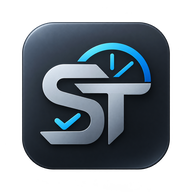
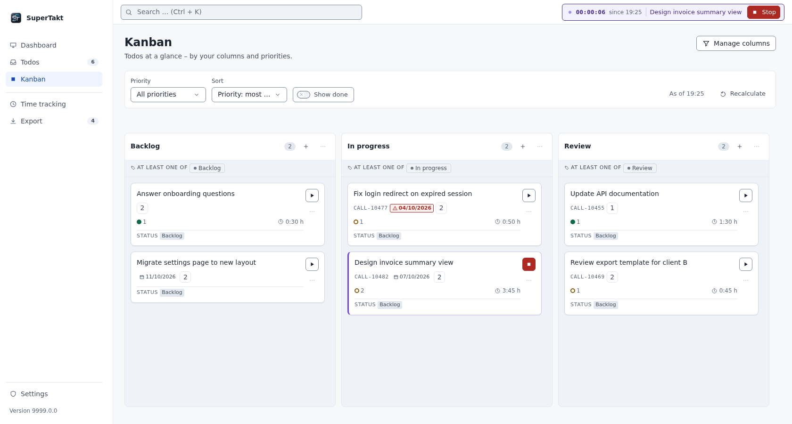
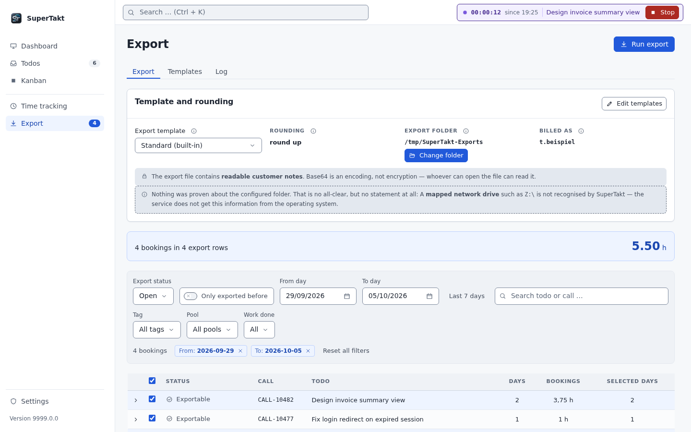

<!-- Screenshots use light/dark pairs; GitHub serves the one matching the viewer's theme. -->

<div align="center">



# SuperTakt

**Plan todos, run a timer on them, and export the hours to your billing tool. Everything stays on your computer.**

[](https://github.com/KuyomieKurama/SuperTakt/releases/latest)
[](https://github.com/KuyomieKurama/SuperTakt/actions/workflows/pruefung.yml)
[](LICENSE)


<a href="https://github.com/KuyomieKurama/SuperTakt/releases/latest"><b>Download</b></a>
&nbsp;&nbsp;&nbsp;
<a href="docs/benutzerhandbuch.md">User guide</a>
&nbsp;&nbsp;&nbsp;
<a href="docs/entwicklerhandbuch.md">Developer guide</a>

<br>
<br>

<picture>
  <source media="(prefers-color-scheme: dark)" srcset="docs/images/supertakt-overview-dark.png">
  
</picture>

<sub>The dashboard with demo data. The timer in the top bar is running on a todo.</sub>

</div>

<br>

SuperTakt is a desktop app for people who track work against todos and then have to bill that time somewhere else. You plan on a Kanban board, start a timer on the todo you are working on, and export the finished bookings as a file your billing tool can read.

It runs entirely on your own machine. There is no cloud service, no account, no database server and no telemetry. Your data lives in one embedded SQLite file in the application data directory.

## Why SuperTakt?

Time tracking usually breaks at the handover. The todo list lives in one tool, the timer in another, and the billing sheet gets rebuilt from memory on Friday afternoon.

SuperTakt keeps the whole path in one place:

- A booking always belongs to a todo, and it is visibly either exported or still open.
- Exports are driven by templates, so the file can match what your billing tool expects.
- The local service listens on `127.0.0.1` only. The one outbound connection is a check for new releases on GitHub, which you can switch off in the settings.

## A closer look

### A board that follows your data

Kanban columns in SuperTakt are rules, not containers. A column is defined by required and excluded tags, status, done state and export state, and a card shows up because it matches. Nothing has to be dragged into place, so the board cannot drift away from what your todos actually say.

<div align="center">
<picture>
  <source media="(prefers-color-scheme: dark)" srcset="docs/images/supertakt-kanban-dark.png">
  
</picture>

<sub>Three columns, each a tag rule. Cards carry the call number, due date and booked time.</sub>
</div>

### From bookings to a billing file

Bookings are grouped per day and todo, and time is rounded in steps of 0.25 h (15 minutes). The built-in template writes the columns `Call`, `Zeit`, `Notiz` and `WindowsUser`. The structure is configurable through export templates. Filter by status, date, tag or pool, check the preview, then run the export into your export folder.

<div align="center">
<picture>
  <source media="(prefers-color-scheme: dark)" srcset="docs/images/supertakt-export-dark.png">
  
</picture>

<sub>Pick a template, filter the open bookings, run the export.</sub>
</div>

### Also in the box

| | |
|---|---|
| Timer that copes with real days | Start and stop from the dashboard, the todo list or a Kanban card. With inactivity detection in the desktop app, idle time can be skipped as a break, assigned to one task or split across several. Open assignments survive a restart. |
| Tags, nested folders, pools | Organise with tags inside folders of any depth, define pools through tags, and set default tags for every new todo, including ones created from Outlook. |
| Outlook add-in | Create a todo straight from an email. If exactly one todo with the same call number already exists, the email is added to it instead of creating a duplicate. |
| Backups and imports | Download a full JSON backup and restore it later, or import from Todoist (CSV) and Super Productivity (JSON). |

## Getting started

### Download

Installers for each release are on the [Releases page](https://github.com/KuyomieKurama/SuperTakt/releases/latest).

| Platform | File |
|---|---|
| Windows 10/11, 64-bit | `SuperTakt_<version>_x64-setup.exe` |
| macOS, Apple Silicon | `SuperTakt_<version>_aarch64.dmg` |
| Debian, Ubuntu and relatives, 64-bit | `SuperTakt_<version>_amd64.deb` |
| Other Linux, 64-bit | `SuperTakt_<version>_amd64.AppImage` |

> [!IMPORTANT]
> The installers are **not code-signed**, so Windows and macOS warn you on first launch. The release notes explain how to proceed and list SHA-256 checksums. There is no build for Intel Macs.

### Run from source

You need Node.js 22.13 or newer, pnpm 11 or newer and a Rust toolchain with the Tauri system libraries for your OS.

```bash
git clone https://github.com/KuyomieKurama/SuperTakt.git
cd SuperTakt
pnpm install
pnpm desktop
```

The first `pnpm desktop` also builds the local service and downloads the pinned Node runtime for it, so it needs network access and some patience.

To try only the interface in a browser, without Rust, run `pnpm dev`. The browser has no inactivity detection and no Tauri shell, so the app shows a notice instead of its data unless a development session is wired up.

```bash
pnpm dev
```

To build an installer package:

```bash
pnpm desktop:build
```

To run the full project checks:

```bash
pnpm check
```

`pnpm check` covers type checks, boundary and contrast checks, proof scripts, tests with coverage, Rust tests, a build and a dependency audit. Some steps need extra system packages. See the [developer guide](docs/entwicklerhandbuch.md) and [apps/desktop/README.md](apps/desktop/README.md).

## Usage

A typical day with SuperTakt:

1. **Set up structure once.** Create tags and folders, then define pools or Kanban columns from them. Add default tags if every todo should start with some.
2. **Capture work.** Create todos in the app, or from an email through the Outlook add-in. On Windows, **Settings → Outlook add-in** guides you through trusting the local certificate. Then import `apps/outlook-addin/manifest.xml` in Outlook and connect it with the access token from the same settings page. The full steps are in [docs/outlook-certificate-setup.md](docs/outlook-certificate-setup.md).
3. **Track time.** Press **Start** on a todo from the dashboard, the todo list or a Kanban card. By default, stopping the timer asks for a short description of the work. That text goes into the billing export, while the todo's own note stays internal.
4. **Review.** The bookings overview shows what has been exported and what is still open.
5. **Export.** On the Export screen, choose a template, check the preview grouped by day and todo, and run the export.

You can switch the interface between German and English in the settings. The [user guide](docs/benutzerhandbuch.md) covers every screen in detail and is currently written in German.

## Tech stack

| Layer | Technology |
|---|---|
| Desktop shell | Tauri 2 with a deliberately thin Rust layer |
| User interface | React, Vite, TypeScript |
| Local service | Node.js sidecar bound to `127.0.0.1` |
| Storage | Embedded SQLite, a single file |
| Outlook add-in | Office.js, TypeScript |
| Testing | Vitest, Playwright |

The code is a pnpm workspace. Business logic in `packages/domain` knows nothing about HTTP or SQL, which keeps storage replaceable. The reasoning is in [docs/architektur.md](docs/architektur.md).

```text
packages/domain        Business rules: rounding, timer, export status, tag tree
packages/storage       Ports and the SQLite adapter
packages/export        Export template engine
packages/ui-tokens     Shared colour, type and spacing tokens
apps/local-api         Local HTTP service
apps/web               The user interface
apps/desktop           The Tauri shell
apps/outlook-addin     The Outlook add-in
```

## Documentation

| Document | Content |
|---|---|
| [docs/benutzerhandbuch.md](docs/benutzerhandbuch.md) | User guide (German) |
| [docs/entwicklerhandbuch.md](docs/entwicklerhandbuch.md) | Project structure, commands, lessons learned |
| [docs/architektur.md](docs/architektur.md) | Architecture decisions |
| [docs/datenarchiv.md](docs/datenarchiv.md) | Backup format and compatibility |
| [docs/glossar.md](docs/glossar.md) | Terms and their counterparts in the code |
| [docs/bedrohungsmodell.md](docs/bedrohungsmodell.md) | Threat model (German) |

## Contributing

There is no separate contribution guide yet. Before changing code, read the [developer guide](docs/entwicklerhandbuch.md) and the project rules in [CLAUDE.md](CLAUDE.md), which define directory ownership and quality gates. Please run `pnpm check` before opening a pull request.

## License

SuperTakt is released under the [MIT License](LICENSE).

## About the name

The product is called SuperTakt. Earlier versions were called Takt, so some internal identifiers, such as the `@takt/*` packages and the application data directories, keep the old name for compatibility with existing installations.
